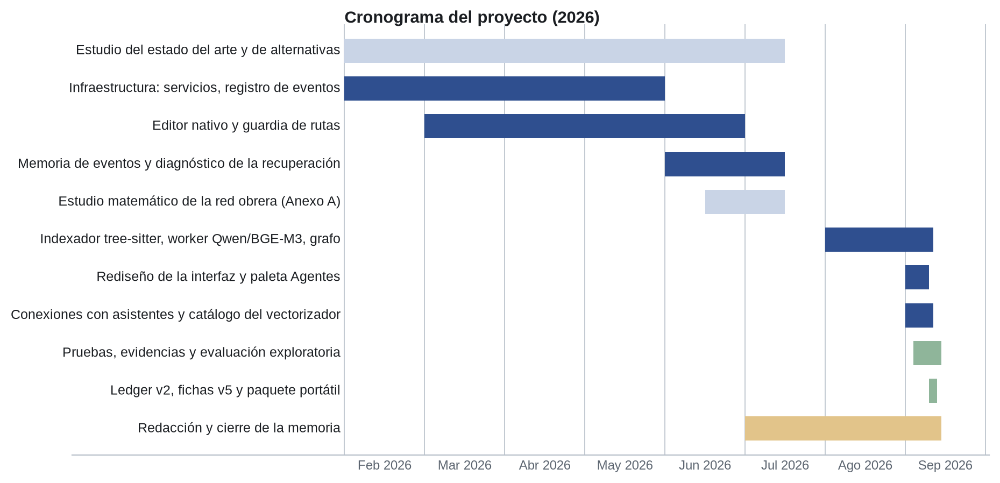
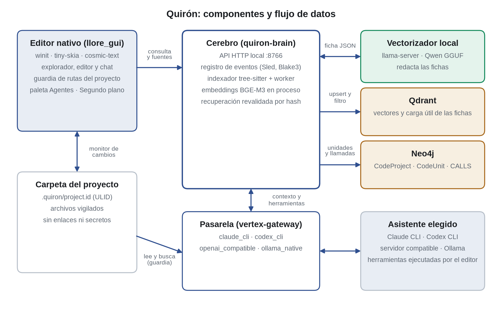
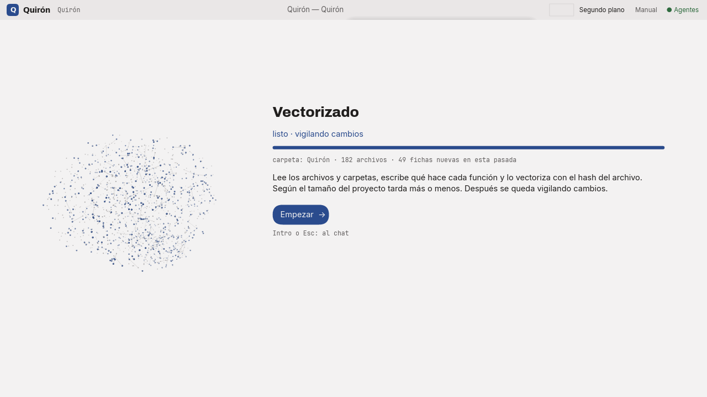
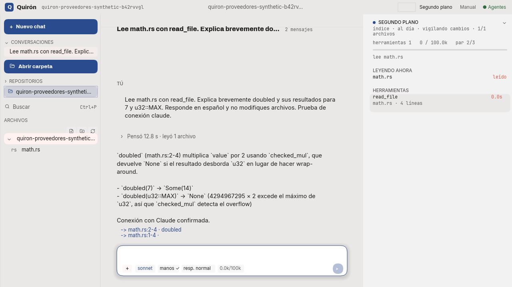
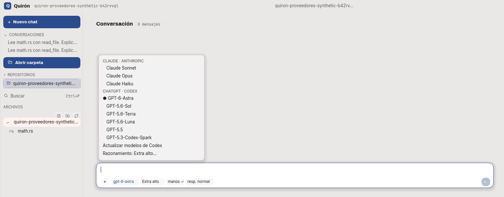

# RESUMEN

Los asistentes de programación conocen el repositorio volcándolo en su ventana de contexto. Ese enfoque no escala: el coste crece con el tamaño del proyecto, la atención del modelo se diluye y en proyectos largos se pierde la consistencia: se duplican lógicas que ya existen y divergen nombres y rutas. Este trabajo presenta Quirón, un editor nativo en Rust que no pretende sustituir el contexto del modelo, sino hacerlo preciso: un índice de código local y verificable le da la localización exacta de cada lógica. Al abrir un proyecto, un worker local recorre sus archivos, extrae unidades sintácticas de Rust, redacta una ficha de cada una con un modelo pequeño (Qwen2.5-Coder-1.5B cuantizado) y la vectoriza con BGE-M3; Qdrant guarda los vectores y Neo4j la pertenencia y las llamadas aproximadas. Cada ficha lleva proyecto, ruta, símbolo, líneas y hash, y la recuperación comprueba su vigencia contra el archivo antes de entregarla al asistente elegido (Claude, Codex, un servidor compatible u Ollama). Un registro inmutable de eventos encadenado por hash conserva la memoria del sistema. La red propia prevista inicialmente se sustituyó por modelos preentrenados y queda como estudio de alternativas. Las evidencias cubren indexación incremental, aislamiento entre proyectos, rondas con proveedores reales y una evaluación exploratoria de localización: el objetivo apareció entre los cinco primeros resultados en las diez preguntas, con fichas que suponen el 0,6 % del código de referencia. El ahorro en tareas completas y la prevención de duplicados siguen como hipótesis por medir.

**Palabras clave:** modelos de lenguaje, recuperación aumentada, índice de código, inferencia local, editor nativo, trazabilidad.

# ABSTRACT

Programming assistants learn about a repository by dumping it, in whole or in part, into their context window. This approach does not scale: cost grows with project size, the model's attention gets diluted and, in long projects, consistency erodes: existing logic gets duplicated and names and paths diverge. This work presents Quirón, a native Rust editor that does not try to replace the model's context but to make it precise: a local, verifiable code index gives the model the exact location of every piece of logic. When a project is opened, a local worker walks its files, extracts Rust syntax units, writes a record for each one with a small model (quantized Qwen2.5-Coder-1.5B) and embeds it with BGE-M3; Qdrant stores the vectors and Neo4j the membership and approximate call relationships. Each record carries project, path, symbol, lines and hash, and retrieval checks its freshness against the file before handing it to the assistant, which can be Claude, Codex, an OpenAI-compatible server or Ollama. An immutable, hash-chained event log keeps the system's memory. Training a proprietary network, part of the initial plan, was replaced by pre-trained models and is documented as a study of alternatives. The evidence covers incremental indexing, isolation between projects, complete rounds with real providers and an exploratory retrieval evaluation: the target appeared among the top five results in all ten questions, with records amounting to 0.6 % of the reference source. Savings on complete tasks and duplicate prevention remain hypotheses to be measured.

**Keywords:** language models, retrieval augmentation, code indexing, local inference, native editor, traceability.

# TABLA RESUMEN

<!-- tabla: Datos generales del trabajo -->
| Campo | Datos |
| --- | --- |
| Nombre y apellidos | Lorenzo Juan Santacreu Pascual |
| Título del proyecto | Quirón: un editor nativo con índice de código verificable y una red neuronal local para el aporte de contexto a modelos de lenguaje |
| Directores del proyecto | [COMPLETAR] |
| El proyecto se ha realizado en colaboración de una empresa o a petición de una empresa | NO |
| El proyecto ha implementado un producto | SÍ: editor nativo con índice de código local y conexión a asistentes |
| El proyecto ha consistido en el desarrollo de una investigación o innovación | SÍ: estudio de la matemática de los modelos recientes para una red local pequeña (Anexo A) |
| Objetivo general del proyecto | Construir un editor nativo cuyo contexto para el modelo de lenguaje procede de un índice verificable, vectores y grafo por proyecto, mantenido de forma continua por una red neuronal local pequeña |

# Capítulo 1. RESUMEN DEL PROYECTO

## 1.1 Contexto y justificación

Trabajar con repositorios grandes exige saber qué hace cada archivo, de qué depende y qué cambió. Los asistentes actuales obtienen ese conocimiento volcando código en la ventana de contexto, y el volcado tiene dos costes que crecen con el proyecto: el económico, que facturado por token de API resulta insostenible a gran escala, y el de consistencia: a cada relectura parcial el asistente renombra lo que ya tenía nombre, duplica lógicas y recrea carpetas. A la vez, los aceleradores locales hacen viable un reparto nuevo: un modelo pequeño en el propio equipo realiza el trabajo continuo y barato de indexar y resumir, y el modelo grande se reserva para lo que solo él puede hacer. La pieza local no genera código: mantiene el índice.

## 1.2 Planteamiento del problema

La pregunta motriz es: **¿puede un índice consultable, vectores, grafo y un modelo local pequeño que lo mantiene, dar al modelo de lenguaje la localización exacta de cada lógica de un repositorio, de modo que gane agilidad, ahorre contexto y deje de perder consistencia, con toda afirmación verificable contra el código de origen?** El índice no sustituye al contexto del modelo: lo hace preciso. El proyecto combina desarrollo de producto e investigación aplicada (el estudio de la red obrera), sin colaboración empresarial.

## 1.3 Objetivos del proyecto

Diseñar y construir un editor nativo cuyo contexto proviene de un índice verificable mantenido por una red neuronal local; el Capítulo 3 detalla los objetivos específicos y su grado de cumplimiento.

## 1.4 Resultados obtenidos

Abrir una carpeta produce en segundo plano un índice de fichas vectorizadas por proyecto que el chat consulta y devuelve como fuentes clicables. Las pruebas registradas cubren apertura, consultas, cambios, borrados, exclusión de secretos y aislamiento entre proyectos, además de rondas completas desde la interfaz con Claude y Codex. En una evaluación exploratoria de localización con diez preguntas, el objetivo apareció entre los cinco primeros resultados en todos los casos. La red propia no se entrenó: el worker usa modelos preentrenados, y su diseño queda como estudio.

## 1.5 Estructura de la memoria

Los capítulos 2 a 9 presentan, por este orden, los antecedentes, los objetivos, el desarrollo y la evaluación, la discusión y los límites, las conclusiones, el trabajo futuro, las referencias y los anexos con las evidencias.

# Capítulo 2. ANTECEDENTES / ESTADO DEL ARTE

## 2.1 Estado del arte

El problema general es el del contexto como recurso escaso: un modelo de lenguaje solo razona sobre lo que cabe en su ventana, y llenarla tiene coste económico y cognitivo.

**El contexto en los asistentes de programación.** La práctica dominante combina el volcado (archivos completos o repositorios resumidos) con la recuperación aumentada: fragmentos seleccionados por similitud vectorial se anteponen a la consulta. La recuperación clásica sobre código presenta dos carencias conocidas: la similitud responde a «qué se parece a esto», pero no a «de qué depende esto», y los fragmentos recuperados no suelen ser verificables contra su origen, lo que deja pasar afirmaciones sin evidencia. Existen trabajos que recuperan información del repositorio para asistir a modelos de código: RepoCoder combina recuperación por similitud y generación iterativa [25]; GraphCoder utiliza grafos de contexto de código para recuperar fragmentos [26]; RepoGraph ofrece una estructura de repositorio que sirve de apoyo a agentes de ingeniería de software [27]. Estos antecedentes sitúan a Quirón: la recuperación de código mediante grafos y vectores no es una invención de este trabajo. Lo que se estudia aquí es la integración de un worker local con un editor nativo, proyecciones incrementales y comprobación de vigencia de las fichas. La matriz siguiente describe ese alcance, no una clasificación exhaustiva de productos.

<!-- tabla: Aspectos cubiertos por Quirón frente a los antecedentes -->
| Aspecto | Aportación desarrollada en Quirón |
| --- | --- |
| Localización | Consulta de fichas con ruta, símbolo, líneas y hash, dentro del editor |
| Mantenimiento | Monitor incremental por proyecto y retirada de unidades desaparecidas |
| Modelos | Generador local sustituible y embeddings independientes |
| Interfaz | Editor nativo con estado del worker, proveedores y fuentes recuperadas |
| Dependencias | Pertenencia y aproximación de llamadas Rust; cobertura incompleta |
| Evaluación | Integración y casos exploratorios; falta comparación de tareas completas |

**Representación vectorial del código.** Los embeddings modernos se entrenan con pérdidas contrastivas tipo InfoNCE [13], que acercan pares positivos y separan negativos. Sobre backbones autoregresivos, el estado del último token sirve como vector de la secuencia (*last-token pooling*) [14][15], lo que permite que un mismo modelo genere texto y produzca embeddings alineados. El aprendizaje de representaciones anidadas (Matryoshka) [16] ordena la información por importancia en las primeras dimensiones, de modo que un vector de 1024 dimensiones puede truncarse con pérdida acotada si se entrenó para ello. En esta versión se emplea `bge-m3` [19][29] (1024 dimensiones) tal como se distribuye: no se entrena una representación propia ni se demuestra que sus vectores puedan truncarse conservando calidad.

**Almacenes especializados.** Las bases vectoriales (Qdrant [17]) resuelven similitud aproximada a escala con filtros exactos sobre la carga útil; las bases de grafo (Neo4j [18]) resuelven recorridos de dependencia. Ninguna de las dos responde por sí sola a las dos preguntas del índice de código; la contribución está en unirlas con una identidad estable por unidad. La existencia de un grafo no implica que sus relaciones resuelvan todos los tipos, importaciones o llamadas del programa.

**La matemática de los modelos recientes, como caja de piezas.** El estudio realizado para este trabajo (Anexo A) extrae los mecanismos matemáticos de los modelos de lenguaje recientes y evalúa su reutilización en una red pequeña, local y exportable:

- *Atención eficiente.* La atención latente multi-cabeza (MLA) comprime el KV-cache a un latente de rango bajo [1][2]; la atención dispersa nativa (NSA) combina compresión, selección top-n y ventana local con un gate diferenciable [3]; la atención lineal reordena el producto para mantener un estado de tamaño fijo d×d con coste constante por paso [4][5][6], mitigando su pérdida de recuperación asociativa con actualizaciones dispersas de estado (SSE) [7]. Esa propiedad no se extiende al modelo completo si se añaden capas de atención completa sobre todo el historial.
- *Mezcla de expertos.* El experto compartido más expertos de grano fino desacopla capacidad de cómputo por token [8], y el balanceo de carga sin pérdida auxiliar corrige el enrutado sin contaminar el objetivo de entrenamiento [9].
- *Destilación.* En la destilación profesor–estudiante, la variante clásica con temperatura requiere los logits del profesor [10]; la destilación a nivel de secuencia solo requiere su texto [11]. Las variantes on-policy (MiniLLM, GKD) exigen de nuevo logits [12a][12b], y la superioridad del KL inverso es cuestión abierta en distribuciones discretas [12c]. QLoRA [24] muestra además que es posible ajustar modelos preentrenados con memoria reducida.
- *Cuantización.* AWQ protege por reescalado los canales salientes identificados por la magnitud de la activación [20]; GPTQ redistribuye el error de redondeo con información de segundo orden [21]. Ambas son post-entrenamiento.

**Hardware y modelos abiertos.** La generalización de aceleradores de consumo, de equipos con memoria unificada y de runtimes portables (llama.cpp [28], ONNX Runtime [22]) hace práctico ejecutar de forma continua modelos pequeños en local. Los informes de Qwen2.5-Coder [23] y Qwen3 [30] describen modelos abiertos de código con tamaños desde 0,5 B hasta decenas de miles de millones de parámetros, cuantizables a 4 bits.

## 2.2 Contexto y justificación

La motivación es triple.

**Económica.** El volcado de contexto se paga por token. Con suscripción, el coste lo absorbe el proveedor hasta el límite del plan; por API, el coste es proporcional al tamaño del proyecto y a la frecuencia de consulta. Un índice que entrega solo los fragmentos necesarios ataca la raíz del gasto: el proyecto entero deja de viajar en cada turno. El acceso principal a los modelos se realiza por las sesiones de suscripción existentes, mediante las CLI oficiales de Claude y Codex; las conexiones compatibles con OpenAI admiten una clave de API si el usuario dispone de ella. La contrapartida de la vía por suscripción, la pérdida de control sobre los parámetros de muestreo del modelo, se asume explícitamente.

**De fiabilidad y consistencia.** Un modelo sin mapa del repositorio comete errores por omisión: reimplementa lógica existente, ignora dependencias, afirma sin evidencia. En proyectos largos comete además errores de consistencia, los más costosos de deshacer: cada vez que relee una parte del proyecto, bautiza con otro nombre lo que ya tenía uno, duplica una lógica o crea una carpeta nueva para algo que ya existía. Un índice con identidad estable por unidad ataca exactamente eso: el modelo va directamente a la lógica localizada en lugar de redescubrirla. Cada fragmento que Quirón entrega lleva ruta, símbolo, rango y hash; toda afirmación es contrastable con el código de origen. La verificabilidad no es una capa estética: es la diferencia entre una respuesta y una conjetura.

**De soberanía.** El código no abandona la máquina salvo en los fragmentos que el usuario decide enviar al modelo: las fichas recuperadas y las lecturas que el asistente pide mediante las herramientas del editor. Los secretos (`.env`, claves, material criptográfico) se niegan siempre, incluso dentro del proyecto. La API local del sistema adopta el formato de mensajes de Anthropic y sirve indistintamente a Claude, Codex o un servidor compatible: el índice no depende del proveedor, por diseño.

El resultado se concibe para el uso individual de un desarrollador en su equipo, sobre repositorios propios de tamaño medio; el índice se construye y se consulta en local.

## 2.3 Planteamiento del problema

Del análisis anterior se desprende la carencia: no existe una solución que una (a) recuperación híbrida vectorial y de grafo con identidad estable y verificable por unidad de código, (b) mantenimiento continuo e incremental del índice por un modelo local pequeño que **propone y no ejecuta**, (c) independencia de un proveedor concreto, con acceso por suscripción o por API según elija el usuario, y (d) la conservación de la consistencia del repositorio como responsabilidad activa del sistema, no como efecto que se espera del modelo. Los asistentes comerciales vuelcan contexto y no exponen su índice; las soluciones de recuperación sobre código no integran el grafo de dependencias ni anclan sus fragmentos a hashes; los modelos pequeños locales no se han aplicado como mantenedores de un índice bajo validación determinista. Ese hueco define los objetivos del capítulo siguiente.

# Capítulo 3. OBJETIVOS

## 3.1 Objetivo general

El objetivo general del presente trabajo, tal como se formuló en el anteproyecto, consiste en **diseñar y construir un entorno de desarrollo nativo cuyo contexto para el modelo de lenguaje procede de un índice verificable, un índice vectorial y un grafo de dependencias por proyecto, mantenido de forma continua por una red neuronal propia, local y pequeña**.

Durante el desarrollo se priorizó el recorrido funcional completo con modelos preentrenados frente al entrenamiento de la red propia. La red neuronal local que mantiene el índice en la versión entregada es, por tanto, un modelo pequeño preentrenado y sustituible, no una red entrenada por el autor. Se conserva la numeración de los objetivos para hacer visible esa evolución en lugar de presentar una reformulación como cumplimiento retroactivo del planteamiento inicial.

## 3.2 Objetivos específicos

- **OE1.** Diseñar la arquitectura de memoria del sistema: registro inmutable encadenado por hash como única fuente de verdad, y proyecciones desechables (índice vectorial y grafo) reconstruibles.
- **OE2.** Implementar el editor nativo con confinamiento al proyecto: guardia de rutas con veredictos diferenciados (secreto, exterior, ruido), fallo cerrado sin proyecto abierto.
- **OE3.** Construir el indexador determinista e incremental sobre tres tipos de unidad (Archivo, Lógica, Cambio), con identificador estable, hash y proyecto en cada unidad.
- **OE4.** Construir el grafo de dependencias particionado por proyecto, con relaciones extraídas por análisis estático y nunca por inferencia del modelo.
- **OE5.** Implementar el worker de recuperación: filtro exacto por proyecto dentro del almacén, búsqueda vectorial, expansión por el grafo, reordenación con reranker y recorte al presupuesto de contexto.
- **OE6.** Estudiar la matemática de los modelos de lenguaje recientes y seleccionar, con criterio de evidencia, los mecanismos reutilizables en una red pequeña exportable a ONNX/Rust.
- **OE7.** Entrenar la red obrera por destilación a nivel de secuencia desde un modelo profesor accesible solo por texto, y desplegarla cuantizada en el runtime local.
- **OE8.** Medir el sistema: reducción del consumo de contexto frente al volcado, calidad de recuperación, aislamiento entre proyectos y fidelidad de las fichas generadas.

<!-- tabla: Grado de cumplimiento de los objetivos específicos al cierre -->
| Objetivo | Estado al cierre |
| --- | --- |
| OE1 | Cumplido en el registro: cadena v2 con hash de todos los campos, transacciones y anclaje compatible; reconstrucción completa del índice de código desde el registro pendiente, el índice se reconstruye desde los archivos |
| OE2 | Cumplido: editor y guardia de rutas con pruebas; quedan carreras posibles del sistema de archivos |
| OE3 | Cumplido para Archivo y Lógica en Rust; el tipo Cambio está definido sin historial completo integrado |
| OE4 | Parcial: pertenencia y llamadas aproximadas en Rust; tipos, importaciones y dependencias completas pendientes |
| OE5 | Parcial: filtro dentro de Qdrant, búsqueda vectorial y expansión limitada por llamadas; reranker y presupuesto de contexto pendientes |
| OE6 | Cumplido: estudio de alternativas con etiquetas de evidencia (Anexo A); no se construyó un nuevo backbone |
| OE7 | No cumplido: entrenamiento excluido del alcance; sustituido por la integración, descarga y selección de modelos preentrenados |
| OE8 | Parcial: evidencias funcionales, aislamiento y evaluación exploratoria de localización; el ahorro en tareas completas no está medido |

## 3.3 Beneficios del proyecto

El beneficio directo es económico y de agilidad: con las lógicas localizadas, el modelo va directo a donde debe ir, y el ahorro de contexto crece precisamente donde más duele, en los repositorios grandes y los proyectos largos. El beneficio de calidad es la conservación de la consistencia: el modelo no repite una lógica que ya existe porque el índice se la pone delante, con evidencia. El beneficio de soberanía es que el código permanece en la máquina y el sistema no depende de un proveedor único. Por último, la reconstruibilidad de las proyecciones convierte el peor error posible del worker en un incidente reversible: una ficha que se regenera o un grafo que se reproyecta, nunca una memoria falsificada. Un hash coincidente acredita la vigencia del archivo, no la corrección de su resumen; Quirón no dispone todavía de un detector automático de lógica duplicada ni de resúmenes por carpeta, que quedan como líneas futuras.

# Capítulo 4. DESARROLLO DEL PROYECTO

## 4.1 Planificación del proyecto

El sistema se levanta en fases, y cada una exige que la anterior funcione. La decisión rectora es que **la red neuronal es la última pieza, no la primera**: las cinco primeras fases producen un sistema útil sin una sola red entrenada por el autor; la sexta lo mejora, no lo sostiene. Construir la red antes que el indexador significaría entrenarla sobre un corpus que no existe. Esa decisión fue la que permitió cerrar el proyecto cuando la sexta fase cambió de naturaleza.

<!-- tabla: Fases del proyecto: planificación y realización -->
| Fase | Periodo (2026) | Contenido planificado | Realización |
| --- | --- | --- | --- |
| F0 | Febrero | Anteproyecto y definición del alcance | Realizada |
| F1 | Febrero–abril | Infraestructura de servicios: cerebro con API local, embeddings y reranker, pasarela a modelos, Qdrant y Neo4j en contenedores | Realizada; el servicio de embeddings pasó después a ejecutarse dentro del cerebro |
| F2 | Abril–junio | Editor nativo, integración de escritorio, confinamiento con pruebas | Realizada |
| F3 | Junio–julio | Arquitectura de memoria: registro inmutable, estados de promoción, diagnóstico medido de la recuperación | Realizada |
| F4 | Julio | Estudio matemático de la red obrera sobre más de 40 fuentes primarias | Realizada (Anexo A) |
| F5 | Agosto–septiembre | Índice de código, grafo de dependencias y recuperación conectada al chat | Realizada con el alcance del Capítulo 3: unidades de Archivo y Lógica en Rust, aristas de llamadas aproximadas, recuperación sin reranker |
| F6 | Septiembre | Red obrera: corpus, destilación, cuantización y despliegue; medición final | Sustituida: worker con modelos preentrenados descargables, selección por dispositivo, proveedores desde la interfaz, paquete Linux y evaluación exploratoria |
| Cierre | 10–13 de septiembre | Redacción final | Contraste entre código y memoria, registro v2, fichas v5, limpieza del código y memoria |

El esfuerzo en horas se recoge en el presupuesto del apartado 4.4. El historial Git del repositorio de entrega comienza el 29 de agosto de 2026 con la reorganización documental del proyecto; el código de las fases F1 a F4 se incorporó en ese primer commit. La entrega del programa, acordada con el tutor, se realiza mediante repositorio: **[COMPLETAR — URL del repositorio de entrega]**. La revisión entregada lleva la etiqueta `entrega-tfm`; el paquete binario incluye un inventario de hashes (`BUILD.json` y `SHA256SUMS`).

## 4.2 Descripción de la solución, metodologías y herramientas empleadas

Quirón se compone de cuatro piezas: el editor nativo, el cerebro (`quiron-brain`: índice, registro de eventos y API local), la pasarela hacia los asistentes (`vertex-gateway`) y el vectorizador local (llama.cpp con un modelo Qwen). En esta memoria «worker» designa el proceso del cerebro que mantiene el índice; en la interfaz aparece como «vectorizador», y el modelo Qwen que redacta las fichas es su generador. La figura resume los componentes y los flujos de datos entre ellos.

### 4.2.1 Arquitectura de memoria: un registro, dos proyecciones

La decisión central del diseño es una asimetría. El **registro de eventos** es inmutable: cada evento (decisión, acción, observación, ejecución, artefacto, alerta, invariante o consulta, con agente, proyecto, descripción, entradas, salidas y métricas) se encadena con el hash del anterior mediante Blake3, de modo que alterar uno invalida todos los posteriores; una afirmación equivocada no se borra, se corrige emitiendo otra que la reemplaza (`supersedes`) o la retracta (`retracted_by`). Sobre el registro se construye la memoria del agente: envolturas con estados de promoción, revisión y retractación, y proyecciones semánticas en Qdrant consultables por similitud (`/search`, `/crag`, `/recall`). Las **proyecciones**, el índice vectorial en Qdrant y el grafo en Neo4j, son desechables por definición: si se corrompen, se destruyen y se reconstruyen. Esa propiedad es la que permite que un modelo escriba en ellas sin poner en riesgo nada irreversible. El editor anota en el registro las ediciones de código como eventos; los hilos del chat se guardan por proyecto en la carpeta `.quiron/`.

El cerebro utiliza Sled [32] como almacenamiento local; el nombre histórico del módulo `storage/rocks.rs` no significa que se utilice RocksDB. La revisión final del registro encontró que la versión inicial del hash no cubría todos los campos del evento y que los índices se escribían en operaciones separadas. La corrección, denominada v2, calcula el hash sobre la serialización completa del evento (salvo su propio hash), con separación de dominio y longitudes delimitadas; evento, índices, versión, anclaje y cabecera se escriben en una transacción de Sled que solicita persistencia antes de confirmar; los escritores comparten un bloqueo y los identificadores duplicados se rechazan, también dentro de un lote. Los eventos históricos conservan sus bytes y su algoritmo, y el primer evento v2 incorpora un anclaje del contenido completo observado al migrar, lo que permite detectar cambios posteriores.

Hay una diferencia con el diseño de julio que conviene dejar clara: el índice de código no se reconstruye desde el registro, sino desde los propios archivos. El worker mantiene un manifiesto y una caché de fichas y vectores en Sled, y confirma cada archivo después de recibir el acuse de Qdrant y de Neo4j. Para el código, la fuente de verdad es el archivo y su hash; el registro conserva la historia de decisiones y ediciones, no la de cada unidad de código. Registrar cambios suficientes para reconstruir el índice desde el registro es una línea futura.

### 4.2.2 Identidad del proyecto y confinamiento del editor

Cada proyecto recibe un identificador propio, un ULID en `.quiron/project.id`, estable frente a mover o renombrar la carpeta; la aplicación migra el estado histórico de `.llore`. El identificador, no la ruta ni el nombre, aparece en el registro, en la carga útil de cada punto vectorial y en el nodo raíz del grafo. La identidad heredada de eventos antiguos se resuelve anotando, nunca reescribiendo: reescribir el pasado rompería la cadena. El worker exige una raíz válida y una identidad coincidente; una copia de la carpeta con la misma identidad no puede monitorizarse simultáneamente como otro proyecto.

El editor arranca sin proyecto y falla cerrado: sin raíz no se lee nada y el chat queda deshabilitado. La primera vez que se abre una carpeta, Quirón pide permiso y explica qué va a hacer con ella antes de crear la identidad. Toda ruta se clasifica antes de tocar el disco comparando formas canónicas, de modo que ni `..` ni un enlace simbólico permiten salir, con tres veredictos: `Secret` (negación absoluta, incluso dentro del proyecto: `.env`, `*.pem`, `id_rsa`, `.ssh/`, `.codex/`), `Outside` (fuera de la raíz; requiere abrir ese proyecto o autorizar) y `Noise` (artefactos generados: ocultos, legibles bajo petición). Un `.env` es secreto; un `.env.example` es una plantilla y se lee. Lo que la guardia niega al editor se lo niega también al worker y a las herramientas del asistente: si un archivo no puede abrirse en una pestaña, tampoco puede acabar convertido en un vector ni leído por el modelo. El confinamiento no es una capa de la interfaz; es la frontera del sistema. La guardia tiene 10 pruebas propias y otras 9 cubren las herramientas del chat que la atraviesan. Las reglas se basan en rutas y nombres; no garantizan detectar credenciales incrustadas dentro de un archivo de código, y persisten carreras posibles entre inspeccionar una ruta y abrirla.

### 4.2.3 El índice de código: archivos, lógicas y fichas

El índice se define sobre tres tipos de unidad: **Archivo** (ruta, lenguaje, hash y una descripción de su responsabilidad), **Lógica** (una por función, método, estructura, enumeración o trait: símbolo, firma, rango de líneas, propósito y hash) y **Cambio** (hash anterior y posterior con motivo). En la versión entregada, el worker genera unidades de Archivo para las extensiones admitidas y unidades de Lógica para Rust mediante Tree-sitter [31], cuya firma y líneas proceden del analizador y no del modelo; el tipo Cambio está definido pero no se registra un historial completo. La cobertura no incluye toda construcción del lenguaje, y los demás lenguajes tienen por ahora ficha de archivo.

Al abrir un proyecto, el worker recorre la carpeta excluyendo enlaces simbólicos, nombres sensibles y directorios generados; cuando la raíz es un repositorio Git respeta el conjunto de archivos seguidos o no ignorados. Los límites son 512 KiB por archivo y 10 000 archivos o 64 MiB de texto por barrido, y una carpeta que los supera se rechaza con la indicación de abrir un proyecto concreto. Después se queda vigilando: revisa cambios cada diez segundos, rehace solo lo que cambia, retira las unidades desaparecidas y comprueba periódicamente la presencia de las unidades en los almacenes para reparar pérdidas desde la caché. Hasta ocho proyectos pueden permanecer monitorizados.

Para cada unidad, el generador recibe hasta 6 000 caracteres numerados por línea y las definiciones de constantes Rust referenciadas cuando caben en un contexto acotado; esas definiciones participan en la huella de caché, de modo que un cambio en ellas invalida la ficha, y las entradas recortadas se marcan como parciales. La respuesta solicitada (ficha v5) es un propósito en una frase completa, el contexto que el modelo no ha podido resolver y entre una y tres líneas de evidencia; el programa copia los fragmentos citados desde el código y convierte sus líneas a posiciones del archivo, de modo que el modelo no redacta las citas. Se rechazan frases incompletas, referencias inexistentes, cifras ausentes del contexto, menciones de lenguajes sin respaldo en la entrada, salidas inválidas y repeticiones de instrucciones. En esos casos se guarda una ficha estructural del analizador con el motivo y `summary_origin=parser`; las aceptadas llevan `model`. Los errores de conexión con el servidor del modelo son reintentables. Las reglas y las citas verifican restricciones concretas, no toda afirmación semántica de la descripción: el modelo puede omitir ramas o efectos.

BGE-M3 [19][29], ejecutado en proceso sobre ONNX Runtime [22], vectoriza ruta, símbolo, firma y descripción. El código completo no se copia al texto vectorizado: el punto conserva ruta, rango y hash Blake3 del archivo para recuperar el original cuando haga falta. Si el archivo cambia, la ficha deja de valer hasta que se rehace: la búsqueda comprueba el archivo antes de devolverla.

El aislamiento entre proyectos se apoya en tres puntos obligatorios: toda unidad lleva `project` en su carga útil; Qdrant aplica el filtro exacto de proyecto y de versiones de modelos dentro de la consulta, antes de calcular similitud; y en Neo4j todo nodo cuelga de un nodo raíz `CodeProject` que ninguna consulta atraviesa. Un fragmento de un proyecto no puede aparecer en las respuestas de otro; la propiedad se probó con dos identidades distintas y contenido idéntico.

### 4.2.4 Grafo de dependencias y recuperación

La similitud vectorial no puede responder «de qué depende esto» ni «qué se rompe si lo cambio»; esas preguntas exigen un grafo. El diseño prevé nodos de proyecto, archivo, módulo, símbolo y cambio con relaciones de importación, llamada, dependencia, definición y cambio, extraídas del árbol sintáctico. En la versión entregada Neo4j contiene los nodos `CodeProject` y `CodeUnit` y las relaciones `HAS_UNIT`, `DEFINED_IN` y `CALLS`. Las llamadas se extraen sintácticamente y se enlazan por reglas de nombre y archivo: `Tipo::metodo` y las funciones por símbolo exacto en todo el proyecto, y los métodos por nombre suelto solo dentro del mismo archivo, porque `push`, `get` o `new` chocan con la biblioteca estándar. Si el análisis estático no resuelve una llamada de forma única, la relación no se crea: lo ambiguo no se inventa. Una coincidencia única de nombre no prueba la resolución semántica del destino, ya que se pierden prefijos de módulo y no se resuelve el tipo del receptor; no se ofrecen garantías de análisis de impacto completo. Un nodo del grafo y un punto vectorial se corresponden por el identificador estable de la unidad.

El worker de recuperación diseñado une los dos almacenes en cinco pasos: filtro exacto por proyecto, búsqueda vectorial (candidatos, no respuestas), expansión acotada por el grafo, reordenación con un reranker y recorte al presupuesto de contexto del consumidor. La versión entregada implementa los tres primeros: la búsqueda de código filtra proyecto y modelos dentro de Qdrant, revalida ruta y hash antes de devolver cada acierto y añade hasta un vecino por llamadas cuando puede obtenerlo del grafo, filtrando proyecto y versiones de modelos también en el vecino y conservando su ficha y su indicador de entrada parcial. No se ejecuta un reranker ni se aplica un presupuesto global medido con el tokenizador del asistente. El checkpoint del indexador solo avanza tras confirmar la escritura en ambos almacenes: una unidad presente en Qdrant y ausente del grafo es un fallo visible y reintentable. La memoria de eventos utiliza otro recorrido, en el que parte del filtrado por proyecto ocurre después de buscar; las garantías del índice de código no se extienden automáticamente a esos endpoints.

### 4.2.5 El editor nativo

El editor de Quirón es una aplicación nativa en Rust: `winit` para la ventana, `tiny-skia` y `softbuffer` para el rasterizado, `taffy` para el layout y `cosmic-text` para el texto. En el repositorio, el crate conserva el nombre `llore_editor`, heredado de un prototipo anterior; el producto es Quirón. No hay navegador ni webview; las tipografías (Inter, JetBrains Mono y los iconos Lucide, con licencia libre) viajan dentro del binario. Un fotograma de interfaz costó 2,4 ms en la medición de julio (1,0 ms de modelado de texto y 1,4 ms de composición de glifos); con repintado por eventos no hay motivo para mover el dibujado a la GPU. El conjunto del editor suma unas 38 000 líneas de Rust repartidas en siete crates, 27 000 de ellas en el de interfaz. La aplicación está integrada en el escritorio con entrada de menú, icono y `app_id` coherente en Wayland y X11.

La interfaz se organiza en una barra lateral con los hilos de conversación del proyecto, los repositorios recientes, la búsqueda de archivos y el explorador; una zona central con el chat y las pestañas de edición; y un panel «Segundo plano» que muestra lo que hace la aplicación en cada momento: la fase del índice, los archivos leídos, el archivo que se analiza, las fichas escritas por el modelo o por el analizador y las herramientas ejecutadas en el turno. La barra del chat crece hasta seis líneas, admite adjuntar y mencionar archivos del proyecto, recuperar preguntas anteriores, cambiar de modelo y elegir la longitud de la respuesta; bajo cada respuesta, las fichas recuperadas aparecen como `archivo:líneas · símbolo` y al pulsarlas se abre el archivo en esa línea. El explorador ofrece las operaciones habituales de archivos y carpetas dentro del proyecto. El manual de uso se abre desde la propia aplicación con F1.

Las herramientas ofrecidas al asistente son `read_file`, `list_files` y `search_text`. Se ejecutan mediante la guardia del proyecto y con límites de salida: 24 000 caracteres por lectura y 60 aciertos de 200 caracteres en las búsquedas. Son manos de lectura, no de edición: el asistente localiza con las fichas y comprueba leyendo, y los cambios los hace el usuario en el editor.

### 4.2.6 Conexión con los modelos de lenguaje

La API local del cerebro (`127.0.0.1:8766`, autenticación por bearer token) es la única puerta al índice: ningún cliente habla directamente con Qdrant ni con Neo4j. El editor envía cada turno a `/v1/messages`, que adopta el formato de mensajes de Anthropic; el cerebro recupera las fichas del proyecto abierto, las añade como pistas al contexto y entrega la petición a la pasarela `vertex-gateway`, que concentra la salida hacia proveedores en un único punto de egreso con cuatro adaptadores: `claude_cli` y `codex_cli`, que invocan las CLI oficiales ya autenticadas con la sesión de suscripción; `openai_compatible`, para OpenAI, un servidor compatible en la red local o la interfaz compatible de Ollama; y `ollama_native`. Cada conversación transmite su proveedor y modelo sin cambiar la configuración del servicio, de modo que elegir Claude o Codex no detiene el worker; en Codex se transmite también el esfuerzo de razonamiento. El selector reúne los alias de Claude (Sonnet, Opus y Haiku) y el catálogo de modelos visibles en la sesión de Codex, que puede actualizarse desde la interfaz. Una suscripción no proporciona un identificador universal de acceso: cada adaptador tiene su propio mecanismo y límites, y los resultados históricos no garantizan disponibilidad futura.

El bucle de herramientas es del editor, no del proveedor: cuando el modelo pide leer o buscar, la pasarela devuelve la solicitud, el editor la ejecuta con la guardia y aporta el resultado al siguiente turno. Codex CLI se ejecuta en un directorio temporal, sin la configuración personal del usuario, con sus herramientas nativas de archivos, comandos y servicios desactivadas y con las credenciales del cerebro, de los almacenes y de otros proveedores retiradas del entorno del subproceso. Es una conversación propia de Quirón, sin heredar el hilo del IDE.

### 4.2.7 La red obrera: del diseño al worker desplegado

La red obrera se concibió como una red neuronal pequeña y propia, entrenada sobre las unidades del índice, que trabaja de forma continua. Sus tareas, por orden: mantener el `project` de cada unidad, clasificar unidades por tipo y responsabilidad, redactar la ficha de cada archivo y cada lógica dentro de los límites, y priorizar candidatos a lógica duplicada para revisión humana. Sus límites no se negocian: toda salida cumple un esquema, se refiere al hash vigente de la unidad y supera validaciones deterministas antes de escribirse; una salida que no valida se descarta y queda registrada. La red no escribe en el registro ni controla el sistema de archivos ni los almacenes: **propone; no ejecuta**.

Del estudio del estado del arte (Anexo A) se deriva su diseño: (1) un backbone híbrido mayormente lineal, con estado recurrente d×d y capas esporádicas de atención completa (~7:1) [4][7]; (2) una cabeza compartida más cabezas por tipo de lógica, inspiración del experto compartido sin enrutado disperso [8]; (3) embeddings de código de 1024 dimensiones entrenados con InfoNCE, obtenidos por last-token pooling y truncables por Matryoshka [13][14][16], de modo que el vector de una unidad sea el estado del último token del resumen que la propia red escribe, y ficha y vector salgan alineados; (4) entrenamiento por destilación a nivel de secuencia [11], la única viable cuando el profesor solo expone texto; (5) despliegue cuantizado INT4 con AWQ [20] sobre el mismo runtime ONNX que ya sirve los embeddings.

Ese entrenamiento se excluyó del alcance final. Pesaron la preparación de un corpus propio revisado, que solo podía existir una vez construido el índice, el coste de iteración y el plazo disponible; para el desarrollo se dispuso de un portátil con una RTX 3060 de 6 GB y de dos estaciones adicionales con dos RTX 3090 accesibles por SSH, y ni el tiempo de corpus ni el de iteración cabían en el calendario junto con el cierre funcional. Como referencia de escala, el informe de Qwen2.5-Coder describe un entrenamiento continuado sobre más de 5,5 billones de tokens [23]; un ajuste mediante QLoRA [24] reduce las exigencias de memoria, pero sigue exigiendo un corpus etiquetado y una evaluación que demuestre mejora frente al modelo base. No se dispone de una comparación que muestre que una red propia rendiría mejor o peor, ni de un presupuesto medido del entrenamiento descartado.

La función prevista del worker se conserva con modelos preentrenados sustituibles: el generador y el modelo de embeddings son dos piezas separadas en lugar de un único backbone, y el código propio integra, valida y controla el recorrido. La configuración de serie emplea Qwen2.5-Coder-1.5B-Instruct Q4_K_M [23] servido por llama.cpp [28] en la GPU (Vulkan) o en CPU, con una solicitud simultánea, contexto de 8 192 tokens y caché de prompts acotada, y BGE-M3 en CPU. El razonamiento del vectorizador va desactivado: su tarea es describir, no conversar, y miles de fichas no pueden esperar. El catálogo de `setup-worker.py` permite descargar modelos con revisión y SHA-256 fijos, y la paleta permite seleccionar cualquier GGUF compatible; la guía por equipo va desde Coder 0,5B sin GPU hasta Qwen3 8B [30] a 4 bits como techo para una GPU dedicada, y solo por encima, en equipos con memoria unificada, Qwen3-Coder 30B-A3B. Un modelo mayor puede mejorar algunas descripciones, pero hay que medir calidad, latencia y memoria; la identificación del generador utiliza su nombre de archivo, y sustituir pesos con el mismo nombre requiere invalidar la caché manualmente. El principio se mantiene: el modelo propone la ficha y el programa la valida, la cita y la escribe.

### 4.2.8 Metodología

Tres reglas ordenaron el trabajo. **Medir antes de decidir:** los diagnósticos se confirman con datos y el tamaño de cualquier red se decidiría sobre corpus real, no por estimación. **Fases deterministas antes que aprendidas:** el indexador debe ser determinista precisamente para que la red pueda ser la última pieza. **Honestidad de evidencia:** el estudio del estado del arte etiqueta cada mecanismo (verificado adversarialmente, canónico no re-verificado, principio de diseño, cuestión abierta) y distingue las cifras autoreportadas de las propiedades deterministas de cada arquitectura. En la evaluación se distinguen cuatro niveles de afirmación: diseño, implementación inspeccionada, prueba funcional registrada y resultado experimental comparativo. Las salidas JSON y las capturas sirven como evidencia de recorridos concretos; una prueba que pasa no acredita comportamientos que no ejercita; cada evaluación registra revisión del código, modelos, corpus, preguntas, métricas y limitaciones, y los errores se conservan junto con los aciertos.

## 4.3 Recursos requeridos

- Portátil con RTX 3060 de 6 GB y 15 GiB de RAM utilizable, Linux (Arch) con servicios de usuario de systemd: equipo de desarrollo y de todas las pruebas registradas.
- Dos estaciones de trabajo adicionales con dos RTX 3090, accesibles por SSH: disponibles; no se atribuyen resultados de entrenamiento.
- Software libre: Rust y su ecosistema (`winit`, `tiny-skia`, `softbuffer`, `taffy`, `cosmic-text`, Tree-sitter, Sled), Qdrant, Neo4j Community, llama.cpp, ONNX Runtime, Docker, Python.
- Modelos preentrenados abiertos: Qwen2.5-Coder-1.5B-Instruct (GGUF Q4_K_M) y `bge-m3` (BAAI).
- Acceso a modelos de lenguaje por suscripción (CLI de Claude y de Codex) y endpoints configurables.
- Xvfb y contenedores para las pruebas de ventana sin pantalla y de compatibilidad de bibliotecas.
- Fuentes primarias de investigación en abierto (arXiv y documentación pública).

El coste inicial de una instalación incluye descargas: aproximadamente 1,15 GB para el runtime y el modelo de serie del worker, además de BGE-M3 y las imágenes de los almacenes. La VRAM observada del servidor Qwen fue de unos 1 130 MiB en la prueba registrada; no representa su pico máximo ni el consumo de todas las configuraciones. Tras una incidencia de presión de memoria durante el desarrollo, las unidades de systemd limitan la memoria del cerebro y del worker y el servidor de Qwen arranca con la caché de prompts acotada.

## 4.4 Presupuesto

<!-- tabla: Presupuesto del proyecto -->
| Tipo de coste | Valor | Comentarios |
| --- | --- | --- |
| Horas de trabajo en el proyecto | [COMPLETAR — horas totales] | Trabajo del autor de febrero a septiembre de 2026; no han participado otras personas |
| Equipo técnico: portátil con RTX 3060 de 6 GB y 15 GiB de RAM | [COMPLETAR — valor de mercado] € | Equipo propio, no adquirido para el proyecto; en él se hicieron todas las pruebas registradas |
| Equipo técnico: dos estaciones con dos RTX 3090 | [COMPLETAR — valor de mercado] € | Equipos propios accesibles por SSH; no se usaron para entrenar |
| Software utilizado | 0 € | Rust, Sled, Qdrant, Neo4j, llama.cpp, ONNX Runtime, Python, Docker y los pesos de Qwen y BGE-M3 son de código abierto o de descarga gratuita bajo sus licencias |
| Suscripciones a asistentes (Claude y ChatGPT/Codex) | [COMPLETAR — gasto real por periodo] € | Usadas como agentes conectados a Quirón y como apoyo al desarrollo; los servidores compatibles y Ollama no requieren suscripción |
| Estudios e informes | 0 € | Todas las fuentes consultadas son de acceso abierto |
| Materiales empleados | 0 € | Sin material de laboratorio; descargas de unos 1,15 GB para el runtime y el modelo del worker, además de BGE-M3 y las imágenes de los almacenes |
| Electricidad y almacenamiento | [COMPLETAR — estimación, si se incluye] | Coste de la inferencia local; no se ha medido el consumo |

No se presenta un coste total hasta completar las filas pendientes. La disponibilidad de software y pesos descargables no elimina las condiciones de licencia ni los costes operativos; la revisión de licencias de distribución acompaña al paquete.

## 4.5 Viabilidad y despliegue

La relación coste/beneficio se apoya en un desplazamiento: el gasto recurrente por token, proporcional al tamaño del repositorio y a la frecuencia de uso, se sustituye por un coste fijo de hardware local ya amortizado y un consumo mínimo de modelo grande. La sostenibilidad futura se apoya en tres propiedades del diseño: los adaptadores de modelo son intercambiables (añadir un proveedor no toca el índice), las proyecciones son reconstruibles (el sistema sobrevive a sus propios errores) y todo el conjunto es software libre ejecutable en una sola máquina. La cuantificación del ahorro en tareas completas no se ha realizado; la única medida disponible es el volumen de las fichas frente al código de referencia (apartado 4.6.4).

Existe un paquete de instalación por usuario para Linux x86_64 que prepara configuración privada, servicios y lanzador. Requiere Python, Docker, systemd de usuario y acceso a las descargas; no es un paquete offline ni una distribución certificada para cualquier Linux. El primer candidato, compilado en el equipo de desarrollo, exigía `GLIBC_2.43` y no cargaba en una base Debian 13 con glibc 2.41. La compilación de entrega pasa a Ubuntu 24.04 (glibc 2.39), con imagen base fijada por digest y Rust 1.93.0, y el empaquetador rechaza símbolos superiores a esa versión; Ubuntu 22.04 se descartó porque el archivo estático de ONNX Runtime utiliza funciones de C23 que su glibc no proporciona. El paquete incluye cinco binarios (editor, cerebro, pasarela, indexador y herramienta del registro), las fuentes, la memoria y las evidencias. Los cinco binarios resuelven sus bibliotecas en Ubuntu 24.04 y Debian 13; en Ubuntu se abrió una ventana Xvfb a 1280 × 720 y se comprobó el instalador en staging, prueba que descubrió bibliotecas X11 cargadas dinámicamente que `ldd` no detecta y que se añadieron al control previo del instalador. No se certifica el ciclo completo con Docker y systemd en una máquina virtual limpia. El paquete comprobado se compiló a partir de la revisión del 10 de septiembre; el script de empaquetado permite regenerarlo desde la revisión entregada.

Los almacenes viven con la aplicación: Qdrant y Neo4j se levantan justo antes del cerebro y se paran con él, escuchan solo en la interfaz local con límites de memoria y no arrancan al encender la máquina. Cerrar la ventana permite continuar el trabajo en segundo plano, y el cerebro se apaga solo tras quince minutos sin uso, teniendo en cuenta las peticiones y los barridos activos.

## 4.6 Resultados del proyecto

### 4.6.1 Pruebas automatizadas

Los tres crates y el instalador disponen de pruebas automatizadas. La tabla recoge la ejecución final sobre la revisión entregada, después de retirar del código los adaptadores y el servicio de embeddings externo que ya no se usaban.

<!-- tabla: Pruebas automatizadas de la revisión entregada -->
| Componente | Pruebas aprobadas | Observaciones |
| --- | --- | --- |
| Editor (workspace de siete crates) | 329 | Tres pruebas ignoradas por defecto; las que usan un servidor simulado necesitan acceso a localhost |
| Cerebro (`--features full`) | 183 | Incluye mutaciones del hash v2, rechazo atómico de lotes, cuatro escritores concurrentes, corrupción, migración y recuperación tras terminar un proceso |
| Pasarela | 12 | Selección explícita de proveedor por conversación y adaptadores vigentes |
| Entrega (instalador) | 9 | Docker simulado; no acreditan una instalación limpia con bases reales |

Las pruebas del cerebro no son una prueba de corte eléctrico ni de todos los fallos de disco posibles. Un error de entrada/salida después de confirmar deja un resultado incierto; un reintento con el mismo identificador se rechaza si ya estaba guardado.

### 4.6.2 Integración y recorridos completos

<!-- tabla: Evidencias funcionales registradas -->
| Evidencia | Qué acredita | Límite |
| --- | --- | --- |
| `2026-09-05/worker-integracion.json` | Dos proyectos sintéticos: consulta, cambios, borrados, exclusión de secretos y enlaces, caché | No mide precisión en proyectos arbitrarios |
| `2026-09-05/agentes/resumen.json` | Rondas de interfaz con Claude, Codex, servidor local y escenarios compatibles simulados | Distinguir inferencia real de transporte simulado |
| `2026-09-05/consulta-codigo.json` | Consultas con fuentes, control de vigencia y uso del chat | Muestra pequeña; incluye respuestas incompletas |
| `2026-09-10/worker-integracion.json` | Repetición sobre dos proyectos temporales: autenticación, consultas, cambios, borrados, proyecciones y ausencia de inferencia sin cambios | Equipo de desarrollo |
| `2026-09-10/gui/gui-edit.json` | Abrir, editar, guardar, deshacer y rehacer con estados intermedios, cerrar y reabrir conservando contenido e identidad, actualizar el índice | Una ventana, un archivo |
| `2026-09-10-estabilidad/worker-integracion.json` | 13 comprobaciones con Qwen, BGE-M3, Qdrant y Neo4j reales, incluidos filtros de vecinos entre proyectos y modelos | Equipo de desarrollo |
| `2026-09-10-proveedores/` | Claude y Codex desde la ventana sobre la misma función, con lectura por herramienta y fuentes verificadas | Dos rondas; no comparan rendimiento |

El registro de eventos verificado el 5 de septiembre contaba 5 057 eventos con cadena válida bajo el algoritmo inicial. La herramienta `ledger_admin` se ensayó sobre una copia antes de aplicarla al servicio: conservó byte a byte los 5 284 eventos existentes y añadió el evento de anclaje, con 5 285 eventos válidos en la comprobación posterior. Una ejecución intermedia de la integración fue interrumpida por el apagado por inactividad del servicio, que detuvo sus almacenes; se conservó ese fallo y se repitió la prueba manteniendo el servicio activo.

Las dos CLI se comprobaron desde la ventana del editor sobre la misma función sintética de cuatro líneas, que duplica un entero mediante `checked_mul`. El worker produjo dos fichas, de archivo y de función, sin recurrir al analizador estructural. En ambos casos el chat recuperó las fichas con sus referencias y hash, el asistente solicitó leer el archivo mediante la herramienta del editor y devolvió `Some(14)` para la entrada siete y `None` para el máximo de `u32`. La CLI de Claude resolvió el alias `sonnet` como `claude-sonnet-5`; Codex utilizó `gpt-6-astra` con esfuerzo `xhigh`. El editor registró 12,8 y 32,8 segundos respectivamente. Al pasar de Claude a Codex no cambiaron los procesos del cerebro ni del worker ni el archivo privado de configuración, las ventanas cerraron normalmente y el código no se modificó. El catálogo consultado con Codex CLI 0.153.0 anunciaba GPT-6 Astra, GPT-5.6 Sol, Terra y Luna, GPT-5.5 y GPT-5.3 Codex Spark: son los modelos visibles en esa cuenta y fecha, no una disponibilidad universal.

### 4.6.3 Diagnóstico medido de la recuperación

En julio, la investigación de por qué la recuperación de la memoria de eventos no consultaba el índice identificó cuatro causas, todas medidas: el binario del cerebro se compilaba sin sus funcionalidades opcionales, el identificador de proyecto difería entre el editor (ruta canónica) y los eventos (nombre), el filtro de proyecto se aplicaba después de la búsqueda en lugar de dentro de Qdrant, y las conversaciones anteriores reaparecían por una búsqueda de palabras clave sobre el registro. Se refutó además, midiendo, una hipótesis plausible: los 1 652 puntos de memoria personal de ámbito global no desplazaban a los del proyecto en consultas reales (los veinticinco vecinos más próximos pertenecían todos al proyecto); la hipótesis del sumidero vectorial procedía de sondear el índice con vectores aleatorios, que gravitan hacia el grupo más denso. Las correcciones deterministas de ese diagnóstico (compilación con `full` por defecto, identidad por ULID, filtro dentro de Qdrant) se aplicaron en agosto y septiembre al índice de código.

### 4.6.4 Evaluación exploratoria de localización

El protocolo utiliza preguntas de localización con símbolos esperados identificados en el código antes de consultar el índice. Mide si el objetivo aparece entre los cinco primeros resultados vectoriales y en el conjunto ampliado por llamadas, y registra el rango de la primera coincidencia. Una coincidencia de símbolo es un indicador de localización; no demuestra que la respuesta explique correctamente su comportamiento. Se compara además el volumen de las fichas recuperadas con el texto de los archivos de código bajo el mismo tokenizador: es una medida del material de contexto, no del coste de una tarea completa ni de la facturación de un proveedor, y responde a la idea del plan de julio de computar el volcado offline en lugar de pagarlo.

La ejecución se conserva en `docs/evidencias/2026-09-10/localizacion.json`, junto con el protocolo `docs/evaluacion/localizacion-v1.json` y el script `scripts/evaluate-index.py`. El conjunto de referencia contiene 140 archivos Rust versionados bajo `src/`, de hasta 512 KiB cada uno. La búsqueda se hizo sobre el índice del proyecto completo, con los modelos ya cargados.

<!-- tabla: Resultados de la evaluación de localización sobre diez preguntas -->
| Medida | Resultado observado |
| --- | --- |
| Preguntas con objetivo entre los cinco resultados directos (Hit@5) | 10 de 10 |
| Media del inverso del rango del objetivo, hasta cinco (MRR@5) | 0,75 |
| Preguntas con objetivo tras la expansión por llamadas | 10 de 10; no aumenta los aciertos en esta muestra |
| Mediana de duración de la petición de búsqueda | 0,111 s |
| Fichas devueltas, contando apariciones entre preguntas | 75; todas coinciden con el proyecto solicitado y con el hash del archivo actual |
| Texto de referencia de los 140 archivos | 420 881 tokens |
| Mediana del conjunto de fichas por pregunta, incluida expansión | 2 491,5 tokens; 0,592 % del volumen de referencia |

Hit@5 cuenta las preguntas cuyo símbolo esperado aparece en los cinco primeros resultados; MRR@5 premia que aparezca antes. Se empleó el tokenizador de Qwen2.5-Coder-1.5B-Instruct mediante `/tokenize`, sin tokens especiales. El informe conserva las preguntas, los objetivos, los resultados completos, los hashes del corpus y los tiempos, y no se detectaron cambios de esos archivos durante la evaluación. El volumen menor de las fichas no se presenta como un porcentaje de ahorro económico: enviar todo el código es solo una referencia de tamaño. Las preguntas proceden del desarrollo, no de un conjunto independiente; tampoco se puntuó la fidelidad de cada resumen ni se comparó el éxito de una tarea completa.

### 4.6.5 Fidelidad de las fichas

Una inspección de las fichas de esos objetivos encontró errores concretos en la versión v4 del worker: `collect_calls` se describía como análisis de TypeScript aunque su integración utiliza Rust; `read_file` mencionaba 1 000 caracteres cuando la constante es 24 000; y `stable_id` situaba al final dos bytes cero que el código intercala como separadores. También había descripciones que terminaban a mitad de frase. Los ejemplos y los fragmentos de contraste se conservan en `fidelidad-observaciones.json`. Esta inspección forma parte del desarrollo, no de una valoración independiente ni de una tasa de error representativa, y confirma que la firma y el código deben prevalecer sobre el texto generado.

La versión v5 de las fichas, descrita en el apartado 4.2.3, se probó sobre una muestra de ocho funciones que comprendía los tres ejemplos problemáticos y cinco funciones sintéticas adicionales. Siete descripciones fueron aceptadas y una se sustituyó por una ficha estructural al no terminar una frase completa. Las citas y los hashes coincidieron con las fuentes, y los tres errores anteriores no reaparecieron. Las descripciones todavía pueden omitir ramas, unidades o efectos. No se establece una tasa de fidelidad semántica ni se extrapola el Hit@5 de v4 a v5 sin repetir la evaluación.

### 4.6.6 Plan de pruebas de julio y grado de ejecución

<!-- tabla: Plan de pruebas previsto en julio y grado de ejecución al cierre -->
| Prueba prevista | Estado | Qué se hizo |
| --- | --- | --- |
| Reducción de consumo: tokens por tarea con índice frente a volcado | Parcial | Solo la referencia de volumen del apartado 4.6.4; no se midieron tareas completas |
| Calidad de recuperación contra un conjunto etiquetado | Parcial | Diez preguntas de localización con objetivos fijados de antemano; sin conjunto independiente |
| Aislamiento: ninguna consulta devuelve unidades de otro proyecto | Cumplida | Comprobación binaria en las integraciones del 5 y del 10 de septiembre, incluida la expansión por grafo |
| Reconstruibilidad: borrar índice y grafo y reproyectar produce el mismo contenido | Parcial | Reparación desde la caché y reindexación desde los archivos; no desde el registro |
| Fidelidad de fichas sobre un conjunto etiquetado | Parcial | Inspección de fichas v4 y muestra de ocho funciones con v5; sin tasa representativa |
| Comparativa de vías de acceso al modelo profesor (suscripción frente a API) | No realizada | Sin entrenamiento no hubo corpus que generar |
| Curva de escalado del consumo sobre repositorios de tamaño creciente | No realizada | Queda como línea futura con el método de cómputo offline ya disponible |

# Capítulo 5. DISCUSIÓN

**El profesor sin logits y la decisión de no entrenar.** El acceso a los modelos grandes es por suscripción: el profesor devuelve texto, no distribuciones. Eso descarta la destilación clásica con temperatura y las variantes on-policy, y deja la destilación a nivel de secuencia como única vía matemáticamente honesta [11]; se asume el matiz de que su justificación es la tratabilidad, no una garantía de que la moda del profesor concentre la probabilidad. La vía por suscripción tampoco permite controlar la temperatura del profesor, que sí controla el acceso por API. Con ese marco claro, la decisión de septiembre fue no abrir la fase de entrenamiento: el corpus solo podía existir después del índice, y el índice, el editor y los proveedores tenían que funcionar de punta a punta antes del cierre. Los modelos preentrenados cumplen hoy la función prevista para la red con una calidad suficiente para localizar; la red propia queda como mejora, no como sostén, exactamente como fijaba la planificación.

**El alcance económico de la validación.** La hipótesis del trabajo se manifestaría con mayor claridad justo donde no puede pagarse la prueba: un proyecto industrial con miles de archivos, donde una sola tarea resuelta por volcado costaría del orden de miles de euros en tokens. Esa barrera no es solo una limitación del estudio: es la evidencia del problema que este trabajo ataca. Por eso el plan de julio proponía computar el consumo del volcado offline con un tokenizador, sin realizar la petición, y repetir la medida sobre repositorios de tamaño creciente para obtener una curva de escalado. La versión entregada aplica la primera idea sobre el propio repositorio (fichas del 0,6 % frente al volcado de 140 archivos) y deja la curva como línea futura. Contar tokens no demuestra calidad equivalente: una evaluación de tareas debe contabilizar instrucciones, fichas, lecturas adicionales, historial, resultados de herramientas y respuesta, y no se presenta el coste de una prueba que no se realizó como evidencia de ahorro.

**Lo que enseñaron el diagnóstico y la auditoría.** Tres hipótesis plausibles sobre el fallo de recuperación de julio resultaron falsas al medirse, y la causa raíz (compilación sin funcionalidades) era invisible desde la conducta del sistema. La lección quedó incorporada: ningún diagnóstico se acepta sin medición, y las sondas sintéticas pueden fabricar patologías que no existen ante consultas reales. La revisión de septiembre repitió la lección en otro plano: contrastar la memoria con el código encontró que el hash del registro no cubría todos los campos, que las escrituras no eran atómicas y que la expansión por el grafo no repetía el filtro de proyecto; las tres cosas se corrigieron y se probaron. Y las fichas v4, que pasaban el esquema, contenían errores de contenido que solo aparecieron al leerlas junto al código; la respuesta fue exigir citas que el programa copia y verifica, no confiar más en el modelo.

**Cambios respecto al planteamiento inicial.** La memoria de eventos y el índice de código compartían colección y ciclo de vida en el diseño de julio; el trabajo los separó conceptual y físicamente: la promoción gobierna la memoria del agente (afirmaciones con incertidumbre), mientras que una unidad de código no tiene incertidumbre, existe o no existe y su hash coincide o no, y se escribe y retira según el hash. De ahí que el índice se mantenga desde los archivos y no desde el registro. El segundo cambio es el ya discutido: modelos preentrenados en lugar de red propia, con generador y embeddings separados en vez de un único backbone. El tercero es que el servicio de embeddings pasó de ser un proceso aparte a ejecutarse dentro del cerebro, y que el reranker previsto no se usa en el recorrido del índice.

**Limitaciones.** El índice de código depende de los archivos y de la caché local; el registro no contiene todo lo necesario para reconstruirlo. Las relaciones de llamadas emplean aproximaciones y no constituyen un análisis semántico completo. El hash comprueba la correspondencia con el archivo; no valida la semántica del resumen, y la similitud no equivale a identidad de comportamiento. No hay reranker, presupuesto de contexto, detector de duplicados ni resúmenes por carpeta. Los resultados de aislamiento sobre dos proyectos son evidencia acotada, no una prueba formal de todas las consultas posibles. El registro v2 no ha sido probado frente a pérdida de alimentación ni resiste a un actor capaz de reescribir toda la base y su cabecera, al no existir una raíz de confianza externa. El modelo de uso evaluado es un escritorio local de un solo usuario; la instalación no está certificada en una máquina limpia y las dos rondas con proveedores no permiten comparar rendimiento.

# Capítulo 6. CONCLUSIONES

## 6.1 Conclusiones del trabajo

Respecto al objetivo general, el trabajo ha construido y verificado un editor nativo que mantiene, mientras se trabaja, un índice de código por proyecto: fichas de archivos y de lógica Rust redactadas por un modelo local pequeño, vectorizadas y proyectadas en Qdrant y Neo4j, con referencias comprobables contra el código vigente y aisladas por identidad de proyecto. El asistente elegido, Claude, Codex, un servidor compatible u Ollama, recibe esas fichas y puede leer el código mediante las herramientas del editor, bajo la misma guardia que confina al propio editor. El registro inmutable de eventos, la infraestructura de servicios y la salida a modelos sin dependencia de un proveedor están construidos y probados.

La pieza aprendida cambió de naturaleza: la red propia no se entrenó, y el worker usa modelos preentrenados sustituibles. La arquitectura que situaba la red como última pieza demostró su valor precisamente ahí: permitió cerrar un sistema útil sin ella, diagnosticar con mediciones, corregir sin reescribir el pasado y acotar el riesgo de la pieza aprendida a errores reversibles. El estudio matemático conserva su valor como exploración fundamentada de la red futura.

La hipótesis central, que el índice reduce el contexto manteniendo la calidad de tareas completas, sigue abierta: la localización funciona en la muestra evaluada y las fichas son una fracción pequeña del código, pero el ahorro por tarea y la prevención de duplicados no se han medido. El grado de cumplimiento de cada objetivo se recoge en el Capítulo 3 para que los resultados puedan evaluarse sin confundir el prototipo con la totalidad del diseño inicial.

## 6.2 Conclusiones personales

Este proyecto ha sido un año de aprendizaje acelerado: de usuario de asistentes de programación a diseñador de la infraestructura que los alimenta. Empecé con una idea sencilla y ambiciosa, que el asistente dejara de releer mi proyecto entero en cada turno, y acabé construyendo un editor, un cerebro con registro inmutable, un índice y una pasarela, y estudiando la matemática de los modelos recientes para una red propia que finalmente no entrené.

Debo decir algo con honestidad. Cuando concebí este proyecto, hace un año, tenía mucho más sentido que hoy. Las alucinaciones eran constantes y la duplicación de lógica era lo normal: el asistente reescribía una función que ya existía tres archivos más allá porque no la había visto, e inventaba firmas que nunca existieron. Un índice verificable contra el código vigente era la respuesta natural a un problema que sufría a diario. En este año, la forma de trabajar con redes neuronales y los propios modelos de lenguaje han avanzado muchísimo: las ventanas de contexto son mayores, los agentes exploran el repositorio con sus propias herramientas y las alucinaciones sobre código que tienen delante son mucho menos frecuentes. Por desgracia para mi trabajo, parte de la motivación original se ha diluido por el camino. No toda: en el día a día Quirón sigue teniendo sentido por velocidad y por ahorro de tokens, porque un conjunto de fichas de unos dos mil quinientos tokens sigue siendo más rápido y más barato que releer cuatrocientos mil, y porque esas fichas están comprobadas contra el código, no adivinadas. La lección que me llevo es que construir infraestructura sobre un límite actual de los modelos es apostar contra su progreso, y ese progreso ha sido más rápido de lo que preví.

La decisión más difícil fue renunciar a entrenar la red obrera y cerrar con modelos preentrenados. La planificación lo había previsto sin saberlo: al poner la red como última pieza, el sistema tenía que ser útil sin ella, y lo es. Aprendí que el orden de las fases es una decisión de riesgo, no de calendario.

Lo que más me ha enseñado ha sido medir. El diagnóstico de julio, donde tres hipótesis plausibles resultaron falsas, y la revisión de septiembre, donde fichas que pasaban el esquema contenían errores que solo aparecían leyendo el código, me han dejado una disciplina: distinguir lo verificado de lo plausible, no aceptar un diagnóstico sin datos y diseñar sistemas cuyo peor error sea reversible. También aprendí, bloqueando el portátil por falta de memoria, que el hardware local tiene límites que hay que respetar por diseño.

Trabajar a diario con modelos de lenguaje, siendo a la vez su primer usuario, su crítico y su arquitecto, me ha dado una idea más clara de lo que pueden hacer hoy y de lo que no: son extraordinarios localizando y explicando cuando tienen el contexto preciso, cada vez mejores buscándolo por sí mismos, y todavía peligrosos cuando lo adivinan. Quirón es mi respuesta para que ese contexto les llegue comprobado, rápido y sin pagar por releerlo.

# Capítulo 7. FUTURAS LÍNEAS DE TRABAJO

- **Red obrera entrenada:** generar el corpus de destilación a partir del índice ya existente, evaluar LoRA/QLoRA o destilación a nivel de secuencia frente al modelo base, y comparar un profesor por API con temperatura controlada o un profesor local con logits.
- **Validación a escala:** curva de escalado del consumo sobre repositorios de tamaño creciente con el cómputo offline de tokens, y comparación de tareas completas con y sin índice en un proyecto real de gran tamaño.
- **Reconstrucción desde el registro:** registrar cambios de código suficientes para reproyectar el índice desde evidencia histórica y probar su equivalencia lógica; ampliar las pruebas del registro v2 a fallos de almacenamiento y pérdida de alimentación, y estudiar puntos de control externos.
- **Grafo y recuperación:** resolver módulos, tipos e importaciones; incorporar el reranker y el presupuesto de contexto con el tokenizador del asistente; ampliar las pruebas de aislamiento a más repositorios.
- **Consistencia activa:** detectar candidatos a lógica duplicada mediante estructura y similitud, con confirmación humana y métricas de falsos positivos; inferir motivos de cambio con evidencia; presentar responsabilidades agregadas por carpeta.
- **Worker:** ampliar la extracción sintáctica a otros lenguajes, comparar generadores y cuantizaciones por fidelidad, latencia y memoria, e identificar los pesos del generador por hash y no por nombre.
- **Distribución:** certificar la instalación en máquinas limpias, empaquetar como AppImage o Flatpak y estudiar la compilación para Windows y para ARM.
- **Integración:** exponer el índice como servidor MCP para otros clientes, importar sesiones archivadas de otros asistentes como evidencia del registro, y admitir consultas multi-proyecto con lista explícita de identificadores, nunca por ausencia de filtro.

# Capítulo 8. REFERENCIAS

Los informes técnicos de modelos se citan como resultados de sus autores; no son mediciones reproducidas en este trabajo.

[1] DeepSeek-AI, "DeepSeek-V2: A Strong, Economical, and Efficient Mixture-of-Experts Language Model", arXiv:2405.04434, 2024.

[2] DeepSeek-AI, "DeepSeek-V3 Technical Report", arXiv:2412.19437, 2024.

[3] DeepSeek-AI, "Native Sparse Attention: Hardware-Aligned and Natively Trainable Sparse Attention", arXiv:2502.11089, 2025.

[4] MiniMax, "MiniMax-01: Scaling Foundation Models with Lightning Attention", arXiv:2501.08313, 2025.

[5] MiniMax, "MiniMax-M1", arXiv:2506.13585, 2025.

[6] Ling Team, "Every Attention Matters: An Efficient Hybrid Architecture for Long-Context Reasoning", arXiv:2510.19338, 2025. https://arxiv.org/abs/2510.19338

[7] Y. Pan, Y. An, Z. Li, Y. Chou, R. Zhu, X. Wang, M. Wang, J. Wang y G. Li, "Scaling Linear Attention with Sparse State Expansion", arXiv:2507.16577, 2025. https://arxiv.org/abs/2507.16577

[8] DeepSeek-AI, "DeepSeekMoE: Towards Ultimate Expert Specialization in Mixture-of-Experts Language Models", arXiv:2401.06066, 2024.

[9] L. Wang, H. Gao, C. Zhao, X. Sun y D. Dai, "Auxiliary-Loss-Free Load Balancing Strategy for Mixture-of-Experts", arXiv:2408.15664, 2024.

[10] G. Hinton, O. Vinyals, J. Dean, "Distilling the Knowledge in a Neural Network", arXiv:1503.02531, 2015.

[11] Y. Kim, A. M. Rush, "Sequence-Level Knowledge Distillation", arXiv:1606.07947, 2016.

[12a] Y. Gu et al., "MiniLLM: Knowledge Distillation of Large Language Models", arXiv:2306.08543, 2023.

[12b] R. Agarwal et al., "On-Policy Distillation of Language Models (GKD)", arXiv:2306.13649, 2023.

[12c] T. Wu, C. Tao, J. Wang, R. Yang, Z. Zhao y N. Wong, "Rethinking Kullback-Leibler Divergence in Knowledge Distillation for Large Language Models", arXiv:2404.02657, 2024. https://arxiv.org/abs/2404.02657

[13] A. van den Oord, Y. Li, O. Vinyals, "Representation Learning with Contrastive Predictive Coding", arXiv:1807.03748, 2018.

[14] L. Wang et al., "Improving Text Embeddings with Large Language Models (e5-mistral)", arXiv:2401.00368, 2024.

[15] D. Kryvosheieva, S. Sturua, M. Günther y H. Xiao, "Efficient Code Embeddings from Code Generation Models", arXiv:2508.21290, 2025. https://arxiv.org/abs/2508.21290

[16] A. Kusupati et al., "Matryoshka Representation Learning", arXiv:2205.13147, 2022.

[17] Qdrant, "Qdrant — Vector Database", documentación. https://qdrant.tech (consultado en septiembre de 2026).

[18] Neo4j, "Neo4j Graph Database", documentación. https://neo4j.com (consultado en septiembre de 2026).

[19] BAAI, modelos `bge-m3` y `bge-reranker-v2-m3`. https://huggingface.co/BAAI (consultado en septiembre de 2026).

[20] J. Lin et al., "AWQ: Activation-aware Weight Quantization for LLM Compression and Acceleration", arXiv:2306.00978, 2023.

[21] E. Frantar et al., "GPTQ: Accurate Post-Training Quantization for Generative Pre-trained Transformers", arXiv:2210.17323, 2022.

[22] Microsoft, "ONNX Runtime", documentación. https://onnxruntime.ai (consultado en septiembre de 2026).

[23] B. Hui et al., "Qwen2.5-Coder Technical Report", arXiv:2409.12186, 2024. https://arxiv.org/abs/2409.12186

[24] T. Dettmers, A. Pagnoni, A. Holtzman y L. Zettlemoyer, "QLoRA: Efficient Finetuning of Quantized LLMs", arXiv:2305.14314, 2023. https://arxiv.org/abs/2305.14314

[25] F. Zhang et al., "RepoCoder: Repository-Level Code Completion Through Iterative Retrieval and Generation", arXiv:2303.12570, 2023. https://arxiv.org/abs/2303.12570

[26] W. Liu et al., "GraphCoder: Enhancing Repository-Level Code Completion via Code Context Graph-based Retrieval and Language Model", arXiv:2406.07003, 2024. https://arxiv.org/abs/2406.07003

[27] S. Ouyang et al., "RepoGraph: Enhancing AI Software Engineering with Repository-level Code Graph", arXiv:2410.14684, 2024. https://arxiv.org/abs/2410.14684

[28] ggml-org, "llama.cpp server", documentación y código. https://github.com/ggml-org/llama.cpp/tree/master/tools/server (consultado en septiembre de 2026).

[29] J. Chen et al., "M3-Embedding: Multi-Linguality, Multi-Functionality, Multi-Granularity Text Embeddings Through Self-Knowledge Distillation", arXiv:2402.03216, 2024. https://arxiv.org/abs/2402.03216

[30] Qwen Team, "Qwen3 Technical Report", arXiv:2505.09388, 2025. https://arxiv.org/abs/2505.09388

[31] M. Brunsfeld et al., "Tree-sitter: an incremental parsing system for programming tools", documentación y código. https://tree-sitter.github.io (consultado en septiembre de 2026).

[32] T. Kemp et al., "sled: an embedded database", código. https://github.com/spacejam/sled (consultado en septiembre de 2026).

# Capítulo 9. ANEXOS Y TRAZABILIDAD

- **Anexo A — Estudio de alternativas para la red obrera:** se incorpora a continuación de este capítulo desde `docs/ESTUDIO_RED_OBRERA.md`. Se conserva como propuesta inicial, con una nota que aclara su relación con la implementación.
- **Anexo B — Informes técnicos de cierre:** `docs/CIERRE_TFM_2026-09-10.md` (contraste entre código y memoria, con los límites técnicos encontrados), `docs/ESTABILIZACION_2026-09-10.md` (correcciones del registro, de las fichas y del paquete) y `docs/CODEX_EN_QUIRON_2026-09-10.md` (integración de Codex).
- **Anexo C — Manual e instalación:** `docs/MANUAL.md` (manual de uso, accesible desde la aplicación), `docs/GUIA_EVALUACION.md` (guía para evaluar la aplicación en otro equipo), `docs/WORKER_Y_PROVEEDORES.md` (contrato del worker y de las conexiones) y `deploy/LINUX.md` (requisitos y límites del paquete Linux). El código es la referencia para resolver cualquier discrepancia con la documentación.
- **Anexo D — Evidencias:** `docs/evidencias/2026-09-05/` para las pruebas de la primera integración y `docs/evidencias/2026-09-10*/` para las del cierre. Los archivos de cada ejecución indican su alcance; una captura o una simulación no se presenta como ensayo de instalación limpia.
- **Anexo E — Fuentes y artefactos:** repositorio de entrega [COMPLETAR — URL], revisión etiquetada `entrega-tfm`. Este Markdown es la fuente de las exportaciones DOCX y PDF, generadas con `scripts/export-memory.py`; el paquete binario se construye con `scripts/package-linux-portable.sh` y lleva su inventario de hashes.
